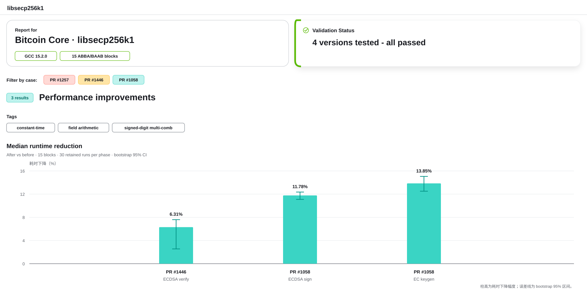

# Task 2：Bitcoin Core 中 libsecp256k1 的常数时间修复与性能改进分析

报告人：安泊仰、李汶峰、赵孙梦元、孙名璋

## 任务说明

本实验以 Bitcoin Core 使用的 `bitcoin-core/secp256k1` 为对象，检查一项常数时间修复和两项性能改进。分析同时结合源码差异、编译后汇编、构建包含轨迹、默认测试和配对微基准，区分源码修改、机器码现象与实际性能结果。

## 完成内容

- 分析 PR #1257 在 Clang 15 下的常数时间条件移动修复
- 验证 PR #1446 删除旧 x86_64 域运算汇编后的实际实现路径
- 分析 PR #1058 的 signed-digit multi-comb 设计及预计算表变化
- 对 ECDSA verify、ECDSA sign 和 EC keygen 进行交错区组微基准
- 保存前后汇编、核心补丁、包含轨迹、原始结果和结构化数据
- 编译并运行四个性能版本的上游默认测试

## 主要结果

| 项目 | 结果 |
| --- | --- |
| PR #1257 | 修复后改为双侧加载并使用掩码合并，避免秘密值直接选择单侧加载地址 |
| PR #1446 ECDSA verify | 区组中位耗时下降 `6.31%`，bootstrap 95% 区间为 `2.55%–7.60%` |
| PR #1058 ECDSA sign | 区组中位耗时下降 `11.78%`，bootstrap 95% 区间为 `11.09%–12.36%` |
| PR #1058 EC keygen | 区组中位耗时下降 `13.85%`，bootstrap 95% 区间为 `12.50%–15.05%` |
| 默认测试 | 四个版本的编译退出码与测试退出码均为 `0` |



图中柱高表示合入后耗时下降幅度，误差线表示 bootstrap 95% 区间。数据来自 15 个交错区组，每个版本、每项操作保留 30 次正式测量。

## 文件

```text
Task 2/
├── code/       # 实验探针、基准测试、默认测试和制图程序
├── data/       # 汇编、补丁、包含轨迹、测试记录和基准数据
├── README.md
└── report.pdf  # 课程作业最终报告
```

主要程序：

- `code/pr1257_cmov_probe_bool.c`：PR #1257 条件移动汇编探针
- `code/pr1446_mul_probe_v2.c`：PR #1446 域乘法实现探针
- `code/run_pr_benchmarks_v3.py`：交错区组性能实验入口
- `code/run_default_tests_all.py`：四个版本的上游默认测试
- `code/render_readme_dashboard.py`：根据结构化结果生成 README 概览图

## 运行

按 `data/repo/README.md` 准备六个上游源码工作树，将 GCC 放入 `PATH`，然后在本目录执行：

```powershell
python .\code\run_pr_benchmarks_v3.py
python .\code\run_default_tests_all.py
python .\code\render_readme_dashboard.py
```

实验脚本从 `data/repo/` 读取源码工作树，将构建产物写入 `builds/`，结果写入 `data/`。仓库已包含报告使用的原始结果，不重新运行也可以检查。

## 实验报告

- [PDF 报告](report.pdf)

报告包含案例筛选、数学背景、源码与机器码分析、实验设计、性能结果、结论边界和关键复现步骤。
