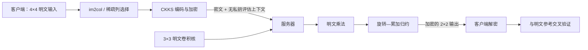

# CKKS 密文卷积的旋转复杂度与稀疏优化

[](https://www.python.org/)
[](https://github.com/OpenMined/TenSEAL)
[](code/test_rotation_experiment.py)
[](LICENSE)

> 《网络安全创新创业实践》Task 6  
> 分析 TenSEAL CKKS 密文卷积的旋转次数，在限定的单密文二叉归约模型内证明其最优性，并验证固定稀疏卷积核的优化收益。

## 项目亮点

- **理论证明**：给出 $n$ 项二叉旋转归约下界 $R_{\min}(n)=\lceil\log_2 n\rceil$；
- **源码对应**：旋转序列与 TenSEAL `enc_matmul_plain_inplace` 的确定性实现逐步对应；
- **稀疏优化**：删除卷积核中的零权重，使旋转数从 4 降为 3；
- **安全验证**：服务端评估上下文不包含私钥；
- **可复现实验**：保存误差、耗时、序列化大小、环境信息及每次试验记录；
- **严谨表述**：明确区分运行时实测、源码推导与数学证明。

## 核心结论

对 `4×4` 输入、`3×3` 卷积核、步长 1、无填充的单通道 CKKS 计算：

| 指标 | 通用卷积 | 固定稀疏核 | 优化效果 |
|---|---:|---:|---:|
| 有效乘加项 | 9 | 8 | −1 |
| 逻辑打包槽数 | 64 | 32 | **−50%** |
| 物理 CKKS 密文数 | 1 | 1 | 不变 |
| 实现推导旋转数 | 4 | 3 | **−25%** |
| 模型内理论下界 | 4 | 3 | 均达到 |
| 最大绝对误差（5 次试验） | $6.807\times10^{-6}$ | $6.813\times10^{-6}$ | 均通过 |
| 服务端求值中位数 | 9.452 ms | 7.746 ms | 样本内 −18.0% |

> 旋转次数是依据 TenSEAL 的确定性 C++ 归约循环推导的，不是运行时 evaluator instrumentation。  
> 逻辑槽数减半不等于密文存储减半；两种方案仍各使用一个物理 CKKS 密文。

## 工作流程



## 快速复现

本项目复用相邻 [Task 5](../task5/) 的 CKKS 客户端/服务器实现。Windows 环境建议显式使用 Python 3.13：

```powershell
cd "1\Task 6\code"
py -3.13 -m pip install -r requirements.txt
py -3.13 -m unittest -v
py -3.13 rotation_experiment.py --trials 5
```

成功运行后，完整证据写入：

```text
code/output/rotation_experiment_results.json
```

常用参数：

```powershell
py -3.13 rotation_experiment.py `
  --trials 20 `
  --tolerance 1e-3 `
  --output output/rotation_experiment_results.json
```

## 仓库结构

```text
Task 6/
├── README.md
├── REPORT.md
├── LICENSE
├── .gitignore
└── code/
    ├── requirements.txt
    ├── rotation_experiment.py
    ├── test_rotation_experiment.py
    └── output/
        └── rotation_experiment_results.json
```

## 文档与证据

- [完整作业报告：问题建模、下界证明、实验与讨论](REPORT.md)
- [实验主程序](code/rotation_experiment.py)
- [自动化测试](code/test_rotation_experiment.py)
- [机器可读实验记录](code/output/rotation_experiment_results.json)
- [TenSEAL 官方 `CKKSVector` 实现](https://github.com/OpenMined/TenSEAL/blob/main/tenseal/cpp/tensors/ckksvector.cpp)

## 结论边界

本项目证明的是 **TenSEAL 当前单密文二叉“旋转—累加”归约模型内的最优性**。改变打包布局、采用多密文并行、baby-step/giant-step 或其他算法时，旋转、乘法、密钥数量、通信量之间可能出现不同权衡。

## License

本项目采用 [MIT License](LICENSE)。
