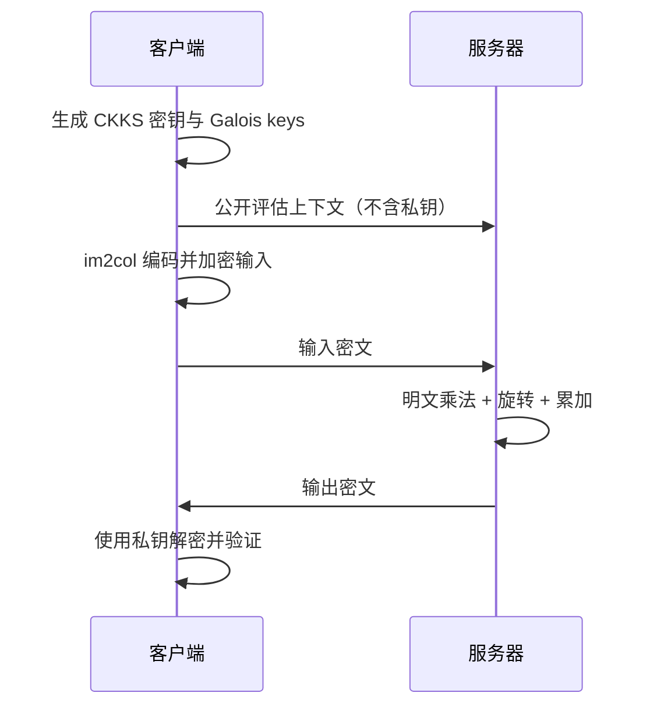

# CKKS 密文卷积的旋转复杂度分析与稀疏优化

> 课程：《网络安全创新创业实践》  
> 作业：Task 6  
> 实验平台：TenSEAL 0.3.16 / Microsoft SEAL / Python 3.13  
> 报告日期：2026-07-26

## 摘要

同态加密允许服务器在不知道明文和私钥的情况下完成计算，但 CKKS 批处理中的密文旋转需要 Galois keys，通常是线性代数算子的主要开销之一。本文研究 TenSEAL 的 `im2col_encoding + conv2d_im2col` 密文卷积路径，回答两个问题：其旋转次数在当前归约模型中是否达到理论下界，以及固定卷积核的稀疏性是否能够减少旋转。

针对 `4×4` 输入和 `3×3` 卷积核，本文从 TenSEAL 的 `enc_matmul_plain_inplace` 实现推导出通用方案的旋转序列为 `[32,16,8,4]`，共 4 次；利用卷积核中的一个零权重删除对应 im2col 列后，旋转序列变为 `[16,8,4]`，共 3 次。本文证明，在单密文二叉“旋转—累加”模型中，合并 $n$ 项至少需要 $\lceil\log_2 n\rceil$ 次旋转，因此两种方案分别达到 $n=9$ 和 $n=8$ 时的模型内下界。

5 次随机化 CKKS 试验全部通过 $10^{-3}$ 的误差阈值，两种方案的最大绝对误差均约为 $6.8\times10^{-6}$。稀疏方案使逻辑打包槽数减少 50%、旋转次数减少 25%；本次样本中服务端阶段耗时中位数从 9.452 ms 降至 7.746 ms。实验同时表明，逻辑槽数减半并不意味着密文存储减半：两种方案均使用一个物理 CKKS 密文，序列化大小基本相同。

**关键词：** CKKS；全同态加密；TenSEAL；密文卷积；槽旋转；im2col；稀疏优化

---

## 1. 研究背景

CKKS 是面向近似实数/复数计算的同态加密方案。它可以把多个数值编码进同一个密文的 SIMD 槽位，并在密文上执行加法、乘法和槽旋转。这种批处理能力适合神经网络中的矩阵乘法和卷积，但也带来新的性能问题：

- 密文—明文乘法负责应用权重；
- 槽旋转负责对齐分散在不同位置的中间结果；
- 密文加法负责完成归约；
- 旋转需要预先生成 Galois keys，并引入额外计算。

因此，减少旋转次数是优化 CKKS 线性算子的一个重要方向。

TenSEAL 将二维卷积转换为 im2col 矩阵与明文卷积核向量的乘法。本项目在 Task 5 已验证的客户端—服务器 CKKS 实现基础上，进一步分析该路径内部的旋转复杂度，并研究固定稀疏卷积核能否降低归约开销。

## 2. 问题定义

### 2.1 输入与输出

实验输入和卷积核为：

$$
X =
\begin{bmatrix}
1&2&3&4\\
5&6&7&8\\
9&10&11&12\\
13&14&15&16
\end{bmatrix},
\qquad
K =
\begin{bmatrix}
1&-1&2\\
0&3&-2\\
2&1&-1
\end{bmatrix}.
$$

采用 CNN `Conv2D` 常用的互相关语义，即不翻转卷积核。步长为 1、无填充，输出为：

$$
Y =
\begin{bmatrix}
26&31\\
46&51
\end{bmatrix}.
$$

### 2.2 研究问题

本文考察两个场景：

1. **通用卷积**：不使用卷积核具体数值，保留全部 9 个核位置；
2. **固定稀疏核**：利用 $K[1,0]=0$，删除恒为零的乘积项，只保留 8 个非零权重。

核心研究问题为：

> TenSEAL 对 9 项和 8 项线性乘加分别需要多少次旋转？这些旋转次数是否达到当前单密文二叉归约模型的理论下界？

### 2.3 威胁模型

本文采用半诚实服务器模型：

- 客户端持有 CKKS 私钥，负责输入加密和输出解密；
- 服务器仅获得不含私钥的公开评估上下文；
- 输入以 CKKS 密文形式发送给服务器；
- 卷积核在本任务中是服务器可见的明文参数；
- 服务器完成密文计算后返回加密结果，无法直接解密输入和输出。



实验程序会显式检查 `server_has_secret_key == false`，避免仅在文档中声明密钥隔离。

## 3. 方法设计

### 3.1 im2col 打包

`4×4` 输入在 `3×3`、步长 1、无填充条件下产生 4 个滑动窗口。每个窗口按行展开为 9 个元素：

$$
\operatorname{im2col}(X)\in\mathbb{R}^{4\times9}.
$$

TenSEAL 为二叉归约将 9 项补齐到下一个 2 的幂，即 16 项。4 个窗口按列式结构打包后，逻辑向量长度为：

$$
4\times16=64.
$$

### 3.2 通用旋转计划

`conv2d_im2col` 会展平卷积核并调用 `enc_matmul_plain`。TenSEAL 的 C++ 实现先执行密文—明文逐槽乘法，再重复以下操作：

1. 复制当前累加密文；
2. 将副本旋转 `rows_nb × remaining_chunks` 个槽；
3. 将旋转结果加回累加密文。

通用 9 项方案的归约过程为：

```text
64 个逻辑槽
  └─ rotate 32 + add
32 个中间组
  └─ rotate 16 + add
16 个中间组
  └─ rotate  8 + add
 8 个中间组
  └─ rotate  4 + add
 4 个输出槽
```

旋转序列为：

$$
[32,16,8,4],
$$

共 4 次旋转。

### 3.3 固定稀疏核优化

卷积核的第 4 个行优先元素为零：

$$
K[1,0]=0.
$$

该位置与任意输入相乘都为零，因此可同时删除：

- 卷积核向量中的零权重；
- im2col 矩阵中与该权重对应的一列。

有效项数由 9 降至 8，而 8 已是 2 的幂，不再需要补零：

$$
4\times8=32
$$

个逻辑槽。归约旋转序列变为：

$$
[16,8,4],
$$

共 3 次旋转。

### 3.4 证据分级

为了避免把不同强度的证据混为一谈，本文使用以下口径：

| 结论或数据 | 证据类型 | 获取方式 |
|---|---|---|
| 解密输出与误差 | 运行时实测 | CKKS 解密结果与纯 Python 参考值比较 |
| 序列化字节数 | 运行时实测 | 统计 `serialize()` 返回值长度 |
| 阶段耗时 | 运行时实测 | `perf_counter_ns()` |
| 密文随机性 | 运行时实测 | 比较多次输入密文的 SHA-256 |
| 旋转步长与次数 | 实现推导 | 对应 TenSEAL 确定性 C++ 循环 |
| 最少旋转次数 | 数学证明 | 限定二叉旋转—累加模型 |

当前 Python API 没有为底层 Microsoft SEAL evaluator 安装旋转计数钩子，因此本文不把旋转次数表述为“运行时动态计数”。

## 4. 理论分析

### 4.1 定理

**定理：** 在单密文、单累加器的二叉“旋转—累加”模型中，将 $n$ 个独立乘积项归约到同一输出槽至少需要

$$
R_{\min}(n)=\lceil\log_2 n\rceil
$$

次旋转。

### 4.2 证明

初始状态下，每个槽只包含一个有效乘积项。一次旋转可以重新排列当前密文中的槽，但不会创造新的独立贡献；将旋转后的密文加回累加器后，每个输出位置包含的有效项数至多翻倍。

设执行 $r$ 次“旋转 + 加法”，则一个输出槽最多聚合 $2^r$ 个初始项。若需要聚合全部 $n$ 项，必须满足：

$$
2^r\ge n.
$$

两边取以 2 为底的对数：

$$
r\ge\log_2 n.
$$

由于旋转次数为整数：

$$
r\ge\lceil\log_2 n\rceil.
$$

证毕。

### 4.3 与实现对照

| 场景 | 有效项数 $n$ | 模型下界 | TenSEAL 实现推导值 | 是否达到下界 |
|---|---:|---:|---:|:---:|
| 通用 `3×3` 卷积 | 9 | $\lceil\log_2 9\rceil=4$ | 4 | 是 |
| 固定稀疏核 | 8 | $\lceil\log_2 8\rceil=3$ | 3 | 是 |

因此，两种实现均达到当前模型的理论下界。

## 5. 实验设计

### 5.1 软件与加密参数

| 项目 | 配置 |
|---|---|
| 操作系统 | Windows 11，64 位 |
| Python | 3.13.14 |
| TenSEAL | 0.3.16 |
| 后端 | Microsoft SEAL |
| 加密方案 | CKKS |
| `poly_modulus_degree` | 8192 |
| 系数模数位长链 | `[60,40,40,60]` |
| 总系数模数位数 | 200 |
| 全局缩放 | $2^{40}$ |
| 物理槽容量 | 4096 |
| 数值误差阈值 | $10^{-3}$ |
| 每种方案试验次数 | 5 |

### 5.2 实验流程

每次试验执行：

1. 客户端完成 im2col/稀疏编码、CKKS 加密和序列化；
2. 服务器从无私钥上下文加载密文，执行卷积并序列化输出；
3. 客户端加载并解密结果；
4. 与纯 Python 明文参考结果逐槽比较；
5. 记录最大/平均绝对误差、阶段耗时和序列化大小；
6. 对输入密文计算 SHA-256，检查随机化加密是否产生不同密文。

上下文和密钥只创建一次，测得初始化耗时为 876.985 ms；该时间不计入单次卷积阶段比较。

### 5.3 验收标准

- 每次试验最大绝对误差不超过 $10^{-3}$；
- 5 次输入加密产生 5 个不同的密文哈希；
- 服务端上下文不含私钥；
- 通用和稀疏方案解密结果一致；
- 实现推导旋转数分别达到模型下界。

## 6. 实验结果

### 6.1 数值正确性

| 指标 | 通用方案 | 稀疏方案 |
|---|---:|---:|
| 明文参考输出 | $\begin{bmatrix}26&31\\46&51\end{bmatrix}$ | 相同 |
| 全部试验最大绝对误差 | $6.807\times10^{-6}$ | $6.813\times10^{-6}$ |
| 各试验平均误差的均值 | $5.292\times10^{-6}$ | $5.276\times10^{-6}$ |
| 误差阈值 | $10^{-3}$ | $10^{-3}$ |
| 通过试验 | 5/5 | 5/5 |

两种方案的误差均比验收阈值低两个数量级以上，说明删除零权重没有改变卷积语义。

### 6.2 复杂度与打包

| 指标 | 通用方案 | 稀疏方案 | 变化 |
|---|---:|---:|---:|
| 有效乘加项 | 9 | 8 | −11.1% |
| 补齐项数 | 16 | 8 | −50% |
| 逻辑打包槽数 | 64 | 32 | −50% |
| 物理密文数 | 1 | 1 | 不变 |
| 实现推导旋转数 | 4 | 3 | −25% |

### 6.3 性能

下表为 5 次试验的阶段耗时中位数：

| 阶段 | 通用方案 | 稀疏方案 | 样本内变化 |
|---|---:|---:|---:|
| 客户端编码、加密、序列化 | 7.722 ms | 6.668 ms | −13.7% |
| 服务端加载、求值、序列化 | 9.452 ms | 7.746 ms | −18.0% |
| 客户端加载与解密 | 1.757 ms | 1.903 ms | +8.3% |

服务端阶段的变化方向与减少一次旋转一致，但 5 次试验只适合功能回归和初步观察，不能作为稳定加速比。正式微基准应增加预热、随机化执行顺序、扩大样本数并报告置信区间。

### 6.4 通信与存储

| 指标 | 通用方案 | 稀疏方案 |
|---|---:|---:|
| 输入密文序列化大小中位数 | 334,299 B | 334,155 B |
| 输出密文序列化大小中位数 | 235,371 B | 235,298 B |
| 服务器公开评估上下文 | 35,482,003 B | 共用 |

虽然稀疏方案的逻辑槽数从 64 降到 32，但二者都远低于 4096 个物理槽的容量，仍各使用一个 CKKS 密文。因此，序列化大小基本相同，不能得出“存储减半”的结论。

### 6.5 安全与随机性检查

| 检查项 | 结果 |
|---|:---:|
| 客户端持有私钥 | 通过 |
| 服务端不含私钥 | 通过 |
| 服务端上下文不是私有上下文 | 通过 |
| 通用方案 5 个输入密文均唯一 | 通过 |
| 稀疏方案 5 个输入密文均唯一 | 通过 |

## 7. 结果讨论

### 7.1 稀疏优化何时有效

旋转次数随非零项数呈阶梯变化：

$$
R(n)=\lceil\log_2 n\rceil.
$$

因此，只有当稀疏化使有效项数跨过 2 的幂边界时，旋转数才会下降。本例由 9 项降至 8 项，正好从区间 $(8,16]$ 进入 $(4,8]$，所以旋转数从 4 降为 3。若从 9 项只降到 8 项以外的情形不存在；对于更大的卷积核，删除少量权重但未跨越边界时，旋转数可能保持不变。

### 7.2 为什么逻辑槽数减半但存储没有减半

`logical_packed_slots` 表示 TenSEAL 向量中有意义的逻辑长度，而 CKKS 密文的物理大小主要由多项式模数次数、系数模数链和密文层级决定。本实验的 64 和 32 个逻辑槽都装在同一个物理密文中，因此通信和存储不会按逻辑长度线性缩小。

### 7.3 “最优”的准确含义

本文证明的最优性具有明确边界：

- 单个 CKKS 密文；
- 单累加器；
- 每一阶段执行一次旋转并加回；
- TenSEAL 当前的 2 的幂补齐与二叉归约方式。

若改变打包布局、并行使用多个密文、采用 baby-step/giant-step 或预计算更多明文掩码，可能用不同的乘法、加法、密钥和存储成本换取更少的旋转。因此本文不声称得到所有 CKKS 卷积算法的全局下界。

### 7.4 实验局限

1. 旋转次数来自官方实现结构推导，没有对底层 evaluator 动态插桩；
2. 当前仅测试一个输入和一个固定卷积核；
3. 性能样本数为 5，尚未达到正式 benchmark 标准；
4. 报告链接 TenSEAL `main` 分支，论文级复现应进一步固定源码 commit；
5. 未单独测量 Galois key 内存、噪声预算和单次旋转微基准。

## 8. 工程质量与可复现性

项目提供：

- 独立依赖文件 `code/requirements.txt`；
- 命令行参数 `--trials`、`--tolerance` 和 `--output`；
- 机器可读的完整 JSON 证据；
- 5 项单元测试；
- 参数、形状、路径和解密长度校验；
- 数值验证失败时的非零退出状态；
- Python/TenSEAL/平台版本记录；
- 从任意工作目录运行时稳定的默认输出路径。

复现命令：

```powershell
cd "1\Task 6\code"

py -3.13 -m pip install -r requirements.txt
py -3.13 -m py_compile rotation_experiment.py test_rotation_experiment.py
py -3.13 -m unittest -v
py -3.13 rotation_experiment.py --trials 5
```

预期检查结果：

```text
Python syntax compilation: PASS
Unit tests:                5/5 PASS
Generic numerical trials: 5/5 PASS
Sparse numerical trials:  5/5 PASS
Server has secret key:     False
```

完整运行记录位于 [`code/output/rotation_experiment_results.json`](code/output/rotation_experiment_results.json)。

## 9. 结论

本文完成了 TenSEAL CKKS 密文卷积旋转复杂度的理论分析、实现对应和数值验证。

对于通用 `3×3` 卷积，9 个有效项被补齐到 16 项，形成 64 个逻辑打包槽，旋转序列为 `[32,16,8,4]`，共 4 次。在固定卷积核中删除唯一零权重后，有效项数变为 8，逻辑打包槽数降至 32，旋转序列变为 `[16,8,4]`，共 3 次。

根据单密文二叉归约下界 $R_{\min}(n)=\lceil\log_2 n\rceil$，两种方案分别达到 9 项和 8 项时的模型内最优值。5 次随机化实验全部通过数值、随机性和密钥隔离检查。稀疏化使逻辑槽数减少 50%、旋转数减少 25%，并在当前小样本中降低了服务端求值时间；但物理密文数与序列化存储基本不变。

这说明稀疏优化的关键不只是“减少零权重”，而是使有效项数跨过 2 的幂边界。同时，FHE 性能报告必须区分逻辑打包长度、物理密文数量、运行时测量和源码推导，才能得到可复现且不过度外推的结论。

## 参考文献

1. Cheon, J. H., Kim, A., Kim, M., & Song, Y. “Homomorphic Encryption for Arithmetic of Approximate Numbers.” *ASIACRYPT 2017*.
2. Benaissa, A., Retiat, B., Cebere, B., & Belfedhal, A. E. “TenSEAL: A Library for Encrypted Tensor Operations Using Homomorphic Encryption.” *ICLR 2021 Workshop on Distributed and Private Machine Learning*.
3. [OpenMined, TenSEAL 官方仓库](https://github.com/OpenMined/TenSEAL).
4. [TenSEAL `CKKSVector` 官方实现](https://github.com/OpenMined/TenSEAL/blob/main/tenseal/cpp/tensors/ckksvector.cpp).
5. [Microsoft SEAL 官方仓库](https://github.com/microsoft/SEAL).

---

本报告的所有数值均可由仓库中的实验脚本重新生成；JSON 文件是报告表格的机器可读证据。
